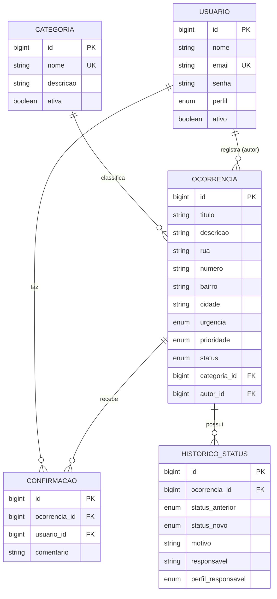

# Modelo de dados

```mermaid
erDiagram
    USUARIO ||--o{ OCORRENCIA : "registra (autor)"
    CATEGORIA ||--o{ OCORRENCIA : "classifica"
    OCORRENCIA ||--o{ CONFIRMACAO : "recebe"
    USUARIO ||--o{ CONFIRMACAO : "faz"
    OCORRENCIA ||--o{ HISTORICO_STATUS : "possui"

    USUARIO { bigint id PK
      string nome
      string email UK
      string senha
      enum perfil
      boolean ativo }
    CATEGORIA { bigint id PK
      string nome UK
      string descricao
      boolean ativa }
    OCORRENCIA { bigint id PK
      string titulo
      string descricao
      string rua
      string numero
      string bairro
      string cidade
      enum urgencia
      enum prioridade
      enum status
      bigint categoria_id FK
      bigint autor_id FK }
    CONFIRMACAO { bigint id PK
      bigint ocorrencia_id FK
      bigint usuario_id FK
      string comentario }
    HISTORICO_STATUS { bigint id PK
      bigint ocorrencia_id FK
      enum status_anterior
      enum status_novo
      string motivo
      string responsavel
      enum perfil_responsavel }
```

Restrição única em `CONFIRMACAO (ocorrencia_id, usuario_id)`.
